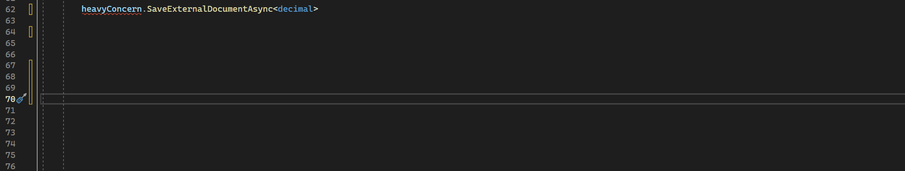

# NSubstituteAutoArgs
Visual Studio extension to fill in NSubstitute setup calls with Arg.Any&lt;T>

NSubstitue is great, but setting up your mock calls with all those "Arg.Any<T>" arguments is a pain.  This Visual Studio code refactoring extension will do it for you.

